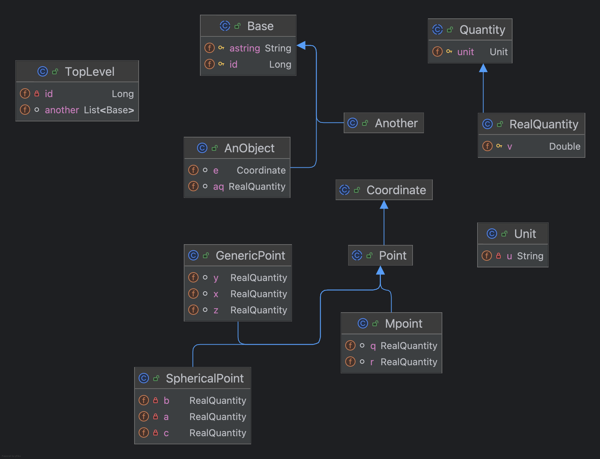

Hibernate problem with complex embeddables
============================================

If there is an embeddable inheritance hierarchy which contains repeated embedded member with association overrides into a complex hierarchy which itself has further embeddables then querying part of the subHierarchy does not work properly

```
./gradlew test
```

will fail on the [second query in EmbeddableTest.java)](./src/test/java/org/example/EmbeddableTest.java)

```java
Error accessing field [org.example.RealQuantity org.example.GenericPoint.x] by reflection for persistent property [org.example.GenericPoint#x] : org.example.Mpoint@1fb00a6d
org.hibernate.property.access.spi.PropertyAccessException: Error accessing field [org.example.RealQuantity org.example.GenericPoint.x] by reflection for persistent property [org.example.GenericPoint#x] : org.example.Mpoint@1fb00a6d

Caused by: java.lang.IllegalArgumentException: Can not set org.example.RealQuantity field org.example.GenericPoint.x to org.example.Mpoint
at java.base/jdk.internal.reflect.UnsafeFieldAccessorImpl.throwSetIllegalArgumentException(UnsafeFieldAccessorImpl.java:167)
at java.base/jdk.internal.reflect.UnsafeFieldAccessorImpl.throwSetIllegalArgumentException(UnsafeFieldAccessorImpl.java:171)
at java.base/jdk.internal.reflect.UnsafeFieldAccessorImpl.ensureObj(UnsafeFieldAccessorImpl.java:58)
at java.base/jdk.internal.reflect.UnsafeObjectFieldAccessorImpl.get(UnsafeObjectFieldAccessorImpl.java:36)
at java.base/java.lang.reflect.Field.get(Field.java:425)
at org.hibernate.property.access.spi.GetterFieldImpl.get(GetterFieldImpl.java:49)
	... 29 more

```

it looks as if it is trying to treat the `org.example.GenericPoint.x` as an `Mpoint` which it cleary is not.

The query can be made to work if the entity manager is cleared between creation and query as in line 49 of  [EmbeddableTest.java)](./src/test/java/org/example/EmbeddableTest.java)




